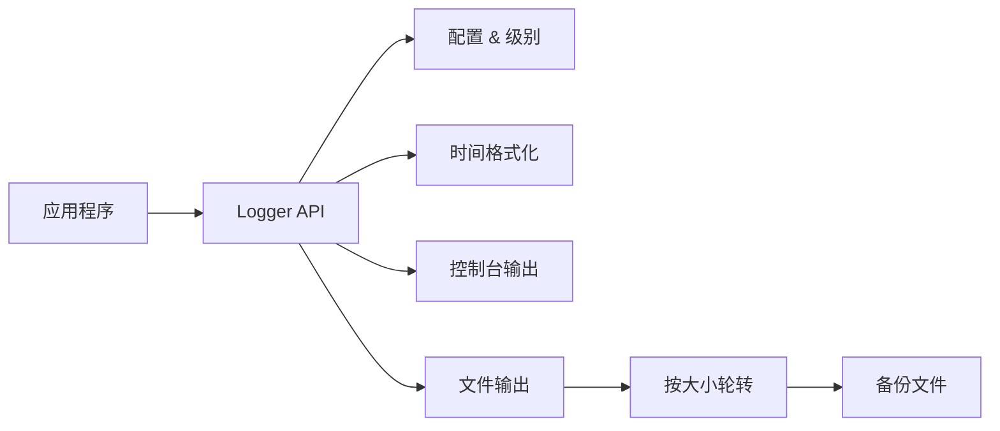

# DESIGN - 日志模块

## 架构图

## 分层与核心组件
- API 层：`log_init/log_set_level/log_log/log_close` 与宏封装。
- 时间层：本地/UTC 获取与格式化。
- 输出层：控制台与文件写入。
- 轮转层：大小阈值检测、备份重命名。

## 模块依赖关系
- API 依赖时间、输出与轮转；输出层独立可替换。

## 接口契约
- `log_init(cfg)`：成功返回 0；失败返回负值。
- `log_set_level(level)`：运行时调整阈值。
- `log_log(level, module, fmt, ...)`：低于阈值丢弃；并发场景未加锁。
- `log_close()`：释放文件句柄、刷新缓冲。

## 数据流向
- 调用 `log_log` → 生成时间戳 → 组装格式化字符串 → 控制台/文件输出 → 文件触发轮转。

## 异常处理策略
- 文件打开失败返回错误码；输出失败不抛异常，尽量继续控制台输出。