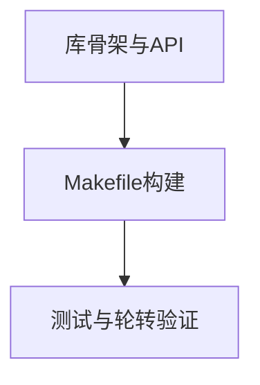

# TASKS - 日志模块

## 原子任务拆分
1. 搭建日志库骨架与 API
   - 输入：C 编译环境、空仓库
   - 输出：`include/logger.h`、`src/logger.c`
   - 验收：编译通过，API 可用
2. 添加 Makefile 构建与测试目标
   - 输入：源代码与测试样例
   - 输出：`Makefile`、静态库产物
   - 验收：`make lib && make test` 通过
3. 编写测试程序验证日志功能与轮转
   - 输入：静态库与测试主程序
   - 输出：`tests/test_logger.c`
   - 验收：控制台输出与文件轮转生效

## 依赖关系（Mermaid）
